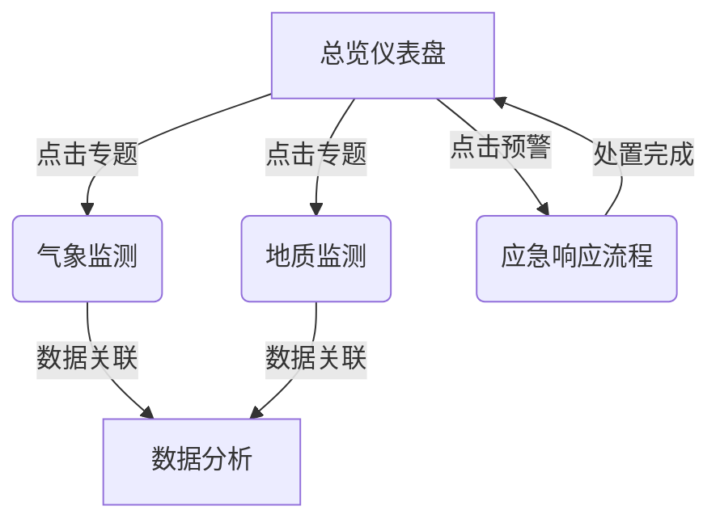

# 智慧大屏可视化平台

## 项目概述
环境监测与应急通信一体化系统的可视化展示平台，提供实时环境数据监测和应急事件响应能力，提升环境安全和应急管理水平。

## 功能模块

### 1. 主总览页面
- 气象预报模块
- 设备监控模块
- 实时警报模块 
- 监控照片模块
- 数据分析模块
- 警告记录模块

### 2. 中央地图警报展示
- 实时展示监测点警报信息
- 颜色编码预警级别(红/橙/黄/蓝)
- 点击查看详细数据和监控图片
- 显示各级别警报数量统计

### 3. 气象预报
- 当前及未来48小时天气信息
- 温度、湿度、风向、能见度等数据
- 极端天气预警功能

### 4. 设备监控
- 设备状态分类显示(异常/休眠/在线)
- 异常设备警报通知
- 设备状态记录与分析

### 5. 实时警报
- 警报事件列表展示
- 事件编号、时间、地点、类型
- 应急响应措施跟踪

### 6. 专项监测页面
- 山火监测
- 桥梁监测
- 矿洞监测

## 系统扩展需求

### 1. 灾害预警分级标准
- 参考《地震灾害预测技术规范》(GB/T 19428-2014)建立四级预警机制：
  - 红色(Ⅰ级)：特别严重
  - 橙色(Ⅱ级)：严重
  - 黄色(Ⅲ级)：较重
  - 蓝色(Ⅳ级)：一般

### 2. 系统集成需求
- 实现与以下系统的数据对接：
  - 气象监测系统
  - 地质监测系统
  - 应急指挥系统
  - 公共安全视频监控系统

### 3. 核心功能扩展
- 灾害风险评估模块：
  - 历史数据分析
  - 实时风险计算
  - 灾害影响预测
- 应急响应模块：
  - 应急预案管理
  - 资源调度跟踪
  - 处置过程记录

### 4. 数据监测与分析
- 实时监测指标：
  - 气象数据(温度、湿度、风速等)
  - 地质数据(位移、沉降等)
  - 水文数据(水位、流量等)
- 数据分析功能：
  - 趋势预测
  - 异常检测
  - 关联分析

### 5. 技术规范参考
- 系统建设应符合：
  - 《应急指挥中心系统建设规范》
  - 《智慧城市应急管理平台技术标准》
  - 《灾害监测数据交换接口规范》

### 6. 实施建议

## 智慧大屏平台设计

### 一、页面体系架构

#### 1. 总览仪表盘（一级页面）
- 核心功能：
  - 全局灾害风险等级展示
  - 实时预警信息滚动
  - 关键指标概览（气象/地质/水文）
  - 应急资源分布热力图
- 设计要点：
  - 80%屏幕面积用于数据可视化
  - 底部保留紧急通知栏

#### 2. 专题监测页面（二级页面）
1. **气象灾害监测**
   - 实时气象数据仪表
   - 台风路径预测
   - 降雨量分布热力图

2. **地质灾害监测** 
   - 地质位移实时监控
   - 隐患点三维展示
   - 沉降变化趋势

3. **水文监测**
   - 水位流量实时数据
   - 洪水淹没模拟
   - 水库容量监控

#### 3. 应急响应页面（流程页）
- 预警发布→预案启动→资源调度→处置跟踪→总结评估
- 各环节状态可视化展示
- 处置进度时间轴

### 二、页面交互关系

### 三、设计规范
1. **视觉标准**
   - 使用红/橙/黄/蓝四色预警标准
   - 关键数据突出显示
   - 信息密度≤3个核心指标/屏

2. **技术要求**
   - 支持4K分辨率输出
   - 数据刷新率≤3秒
   - 多源数据融合接口
1. 先期重点建设：
   - 基础监测网络
   - 实时预警系统
   - 应急响应流程
2. 后期逐步扩展：
   - 智能分析功能
   - 移动应急终端
   - 多部门协同平台

### 7. 图形界面设计

#### 页面顶部
- 标题（居中）："环境监测与应急通信一体化系统"，白色字体
- 右上角显示：
  - 当前时间：2023年7月25日 14:10:10 星期二
  - 当前天气：晴，29°C

#### 中部核心：地图与监测点信息
- 显示省级/地市级行政区域地图
- 监测点标记：
  - 红色（严重预警）
  - 黄色（一般预警）
  - 蓝色（正常）
- 地图右上方显示各状态站点数量统计
- 地图下方显示应急物资设备编号及状态

#### 左侧区域：天气信息与站点状态
- 天气模块：
  - 当前天气状态及温度
  - 24小时气温变化趋势图
  - 实时气象数据（温度、湿度、风速等）以圆环图展示
- 设备在线状态：
  - 在线/离线数量统计
  - 环形图展示比例
- 报警统计：
  - 近7天报警事件类型与数量
  - 按严重程度分类（红/黄/蓝）

#### 右侧区域：视频监控与数据分析
- 视频模块：
  - 实时视频画面预览
  - 分页显示（如4/12）
- 数据分析图：
  - 多指标折线图/面积图（温度、PM2.5等）
- 告警记录：
  - 事件日志形式展示
  - 包含时间、类型、地点、级别
  - 颜色标示事件级别

#### 界面风格
- 科技蓝配色为主
- 丰富的数据可视化（圆环图、折线图、热力图等）
- 模块化布局设计
- 面向环保局、应急管理局等政府机构

## 技术架构建议

### 前端技术
- Vue.js/React 框架
- ECharts 数据可视化
- Mapbox/高德地图 API
- Element UI/Ant Design 组件库

### 后端技术
- Node.js/Java Spring Boot
- WebSocket 实时通信
- MySQL/PostgreSQL 数据库
- Redis 缓存

## 开发计划建议

### 第一阶段：基础框架
1. 搭建前端项目结构
2. 实现主总览页面布局
3. 开发地图基础功能

### 第二阶段：核心功能
1. 设备监控模块实现
2. 实时警报列表功能
3. 基础数据可视化

### 第三阶段：专项功能
1. 山火监测页面
2. 桥梁监测页面
3. 矿洞监测页面

### 第四阶段：优化扩展
1. 移动端适配
2. 系统管理功能
3. 性能优化

## 运行要求
- Node.js 14+
- 现代浏览器(Chrome/Firefox/Edge)
- 地图API密钥
- 后端数据服务接口